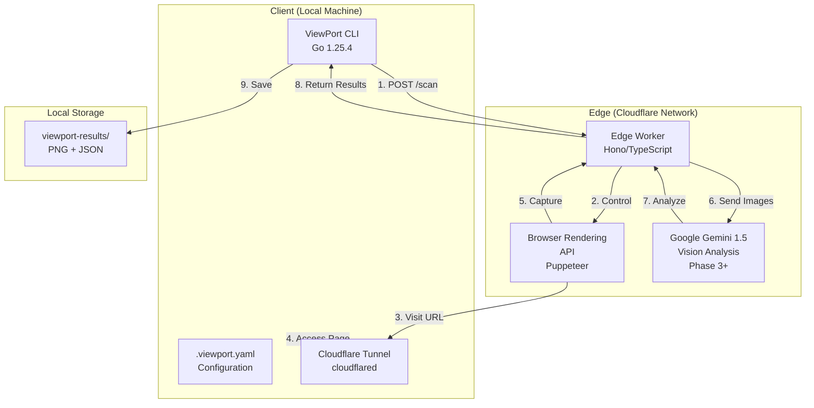

# ViewPort-CLI: Project Architecture & Implementation Plan

## 1. Executive Summary

**ViewPort-CLI** is a developer tool designed to bridge the gap between local development environments and the diverse reality of end-user devices. By leveraging Cloudflare Tunnels, Headless Chrome (Puppeteer), and Multimodal AI (Gemini), it provides instantaneous, "pre-commit" visual regression testing and responsive design auditing directly from the terminal.

## 2. Problem & Solution

### The Problem: Localhost Myopia
Developers build on high-end devices, missing issues that appear on mobile or different viewports. Manual resizing is tedious, and existing visual testing tools are CI-centric, not dev-loop centric.

### The Solution: AI-Powered Responsive Design Auditor
A single command (`viewport-cli scan`) that:
1. **Exposes** local port via a secure tunnel
2. **Renders** the page on remote headless browsers
3. **Analyzes** viewports using AI for layout shifts, overflows, and regressions
4. **Reports** results back to the CLI

## 3. Current Architecture

The system employs a **Hybrid Architecture**:
- **Client**: Go-based CLI (Native performance, single binary)
- **Backend**: Cloudflare Workers (Serverless, Low-latency, Scalable)



## 4. Tech Stack & Standards

### Phase 1: Backend Foundation ✅ COMPLETE

**Location**: `/workspaces/viewport-cli/worker/`

**Language**: TypeScript + Hono on Cloudflare Workers

**Components**:
- `src/index.ts` - Hono REST API with POST /scan endpoint
- `src/services/screenshot.ts` - Puppeteer integration
- `src/types/api.ts` - Type definitions

**Key Technologies**:
- **Framework**: Hono (Web Standard based, lightweight)
- **Browser Rendering**: Puppeteer + Cloudflare Browser Rendering API
- **Output**: PNG binary + JSON metadata
- **Multi-viewport**: Mobile (375×667), Tablet (768×1024), Desktop (1920×1080)

**Features**:
- ✅ Real screenshot capture via Puppeteer
- ✅ Multiple viewport support
- ✅ Result storage with PNG + JSON
- ✅ Cloudflare Browser API fallback
- ✅ Error handling and validation

### Phase 2: Client Foundation ✅ COMPLETE

**Location**: `/workspaces/viewport-cli/cli/`

**Language**: Go 1.25.4 (Native compiled binary, 13MB)

**Architecture**:
```
main.go                 # Entry point
├── cmd/
│   ├── root.go        # Root command registration
│   ├── scan.go        # Scan command (235+ lines)
│   └── config.go      # Config & results commands
└── pkg/
    ├── api/           # Backend HTTP client
    ├── config/        # .viewport.yaml management
    ├── tunnel/        # Cloudflare tunnel integration
    └── results/       # Results parsing & display
```

**Key Technologies**:
- **CLI Framework**: spf13/cobra 1.10.2
- **HTTP Client**: go-resty/resty 2.17.0 (with retry)
- **TUI**: charmbracelet/bubbletea 1.3.10
- **Styling**: charmbracelet/lipgloss 1.1.0
- **Config**: spf13/viper 1.21.0
- **Encoding**: encoding/base64 (PNG binary)

**Commands Implemented**:
- `viewport-cli scan` - Execute responsive design scans
- `viewport-cli config init` - Interactive setup wizard
- `viewport-cli config show` - Display configuration
- `viewport-cli results list` - View scan history

**Features**:
- ✅ Multi-viewport scanning (mobile, tablet, desktop)
- ✅ Configuration system (.viewport.yaml)
- ✅ Tunnel integration (cloudflared CLI)
- ✅ Results listing with metadata
- ✅ Pretty terminal output with emojis and colors
- ✅ Environment variable overrides (VIEWPORT_* prefix)
- ✅ CLI flag overrides

### Phase 3: AI Analysis 🚀 IN PROGRESS

**Location**: `/workspaces/viewport-cli/cli/cmd/` (additions)

**Planned Components**:
- Vision analysis service using Google Gemini API
- Issue detection and classification
- Score calculation and recommendation generation
- Analysis storage alongside scan results
- `results analyze <id>` command for detailed analysis
- `scan --analyze` flag for automatic analysis

**Key Technologies**:
- **AI Provider**: Google Gemini 1.5 Flash (Vision model)
- **Go SDK**: google/generative-ai-go
- **Storage**: Extended JSON metadata in results

**Planned Features**:
- Screenshot analysis for responsive design issues
- Accessibility evaluation
- Performance observations
- Best practices recommendations
- Score and severity levels
- Trend tracking across scans

### Phase 4: Reporting & IDE Integration 🚧 PLANNED

**Planned Components**:
- HTML report generation
- PDF export
- JSON report export
- Scan comparison across time
- VS Code extension for inline feedback

## 5. Data Structures

### API Contract: Scan Request
```json
{
  "targetUrl": "https://tunnel-url.trycloudflare.com",
  "viewports": ["mobile", "tablet", "desktop"],
  "options": {
    "fullPage": true
  }
}
```

### API Contract: Scan Response
```json
{
  "scanId": "uuid-here",
  "timestamp": "2025-12-14T17:13:00Z",
  "status": "SUCCESS",
  "results": [
    {
      "device": "mobile",
      "dimensions": {
        "width": 375,
        "height": 667
      },
      "screenshotBase64": "iVBORw0KGgoAAAANSUhEUgAAAAUA...",
      "issues": []
    }
  ]
}
```

### CLI Storage: Scan Metadata
```json
{
  "scanId": "8eb4eed6-faa8-4f3b-aec0-fd9543ef",
  "timestamp": "2025-12-14T17:13:00Z",
  "status": "SUCCESS",
  "viewports": ["mobile", "tablet"],
  "issueCount": 0
}
```

## 6. Project Structure

```
viewport-cli/
├── README.md                    # Project overview & quick start
├── PLAN.md                      # This file - Architecture planning
├── PHASE1_FINAL.md              # Phase 1 documentation
├── PHASE2_FINAL.md              # Phase 2 documentation
├── PHASE3_PROPOSAL.md           # Phase 3 specification
├── SCREENSHOT_TESTING.md        # Testing guide
│
├── viewport-results/            # Results storage (gitignored)
│   └── {scan-id}/
│       ├── metadata.json
│       ├── mobile-375x667.png
│       ├── tablet-768x1024.png
│       └── desktop-1920x1080.png
│
├── worker/                      # Phase 1: Cloudflare Worker Backend
│   ├── src/
│   │   ├── index.ts            # Hono API - POST /scan endpoint
│   │   ├── types/
│   │   │   └── api.ts          # Type definitions
│   │   └── services/
│   │       └── screenshot.ts   # Puppeteer integration
│   ├── wrangler.jsonc          # Cloudflare config
│   ├── package.json
│   └── tsconfig.json
│
├── test-server/                 # Test infrastructure
│   ├── server.js               # Node.js test server
│   └── test.html               # Test webpage
│
└── cli/                         # Phase 2: Go CLI Client
    ├── main.go                 # Entry point
    ├── go.mod                  # Go module definition
    ├── go.sum                  # Dependency lock
    ├── viewport-cli            # Compiled binary (13MB)
    ├── cmd/
    │   ├── root.go             # Root command & version
    │   ├── scan.go             # Scan command implementation
    │   └── config.go           # Config & results commands
    └── pkg/
        ├── api/
        │   └── client.go       # HTTP client for backend
        ├── config/
        │   └── config.go       # .viewport.yaml management (160+ lines)
        ├── tunnel/
        │   └── tunnel.go       # cloudflared integration (155+ lines)
        └── results/
            └── results.go      # Results parsing (176 lines)
```

## 7. Implementation Phases

### Phase 1: Backend Foundation ✅ COMPLETE
**Goal**: Deploy a Cloudflare Worker that captures screenshots

**Completed**:
- ✅ Hono REST API with POST /scan endpoint
- ✅ Puppeteer integration for browser automation
- ✅ Multi-viewport screenshot capture
- ✅ PNG binary output + JSON metadata
- ✅ Cloudflare Browser API fallback
- ✅ Error handling and validation

**Timeline**: 1 development session

### Phase 2: CLI Client ✅ COMPLETE
**Goal**: Build a feature-complete CLI that manages scans and configuration

**Completed**:
- ✅ Go module setup with cobra CLI framework
- ✅ HTTP client for backend communication
- ✅ Scan command with multi-viewport support
- ✅ Configuration system (.viewport.yaml)
- ✅ Cloudflare tunnel integration
- ✅ Results listing and history tracking
- ✅ Pretty terminal UI with lipgloss styling
- ✅ PNG binary encoding fix
- ✅ Table alignment perfection

**Key Achievements**:
- Single 13MB binary (no dependencies required)
- <100ms startup time
- Comprehensive config management
- Beautiful terminal output

**Timeline**: 1 development session

### Phase 3: AI Analysis 🚀 IN PROGRESS
**Goal**: Integrate Google Gemini for intelligent screenshot analysis

**Planned Tasks**:
- [ ] Set up Google Gemini API integration
- [ ] Create vision analysis service
- [ ] Implement issue detection algorithm
- [ ] Build scoring system
- [ ] Add `scan --analyze` flag
- [ ] Implement `results analyze` command
- [ ] Store analysis data with results
- [ ] Create analysis display formatting

**Expected Timeline**: Next development phase

### Phase 4: Reporting & IDE Integration 🚧 PLANNED
**Goal**: Generate beautiful reports and IDE integration

**Planned Features**:
- [ ] HTML report generation
- [ ] PDF export
- [ ] JSON export
- [ ] Scan comparison/trending
- [ ] VS Code extension

## 8. Configuration Strategy

**File**: `~/.config/viewport-cli/.viewport.yaml`

```yaml
api:
  url: http://localhost:8787              # Backend API endpoint

scan:
  viewports: [mobile, tablet, desktop]    # Default viewports to test
  output: ./viewport-results               # Results directory
  tunnel: false                            # Enable Cloudflare tunnel
  timeout: 60                              # Scan timeout (seconds)

tunnel:
  name: viewport-scan                      # Tunnel name
  auto_cleanup: true                       # Auto-cleanup on exit

display:
  verbose: false                           # Verbose logging
  no_color: false                          # Disable colors
  no_table: false                          # Disable table formatting
```

**Override Precedence** (highest to lowest):
1. CLI flags (`--target`, `--viewports`, etc.)
2. Environment variables (`VIEWPORT_API_URL`, `VIEWPORT_TUNNEL`, etc.)
3. `.viewport.yaml` configuration file
4. Built-in defaults

## 9. Performance Targets

### Backend (Phase 1)
- Response time: 1-3 seconds per scan
- Concurrent requests: Multiple simultaneous scans
- Output: PNG files (50-200KB each) + JSON metadata

### CLI (Phase 2)
- Binary size: 13MB (single executable, no runtime)
- Startup time: <100ms
- Scan execution: 0.5-3 seconds (depending on viewport count)
- Memory usage: ~50MB during operation

### AI Analysis (Phase 3)
- Expected: <2 second analysis per screenshot
- Concurrent: Single analysis at a time (rate-limited by API)

## 10. Development Decisions

### Why Go?
- Single compiled binary (no runtime needed)
- Fast startup and execution
- Excellent concurrency model
- Cross-platform compilation

### Why Hono?
- Lightweight on Cloudflare Workers
- Web Standard based (future-proof)
- Simple routing for REST API
- Good TypeScript support

### Why Cloudflare Workers?
- Serverless (no infrastructure management)
- Low-latency edge execution
- Free tier for development
- Built-in Browser Rendering API

### Why Gemini API?
- Vision model capabilities
- Good for analyzing page layouts
- Competitive pricing
- Easy integration

## 11. Known Limitations & Future Work

### Current Limitations
- No authentication (tunnel URL public)
- Single scan at a time
- No historical comparison
- No IDE integration

### Planned Improvements
- [ ] Authentication/authorization
- [ ] Parallel scan execution
- [ ] Trend analysis across scans
- [ ] Performance metrics
- [ ] Accessibility deep-dive
- [ ] VS Code extension
- [ ] GitHub Actions integration
- [ ] Slack notifications

## 12. Testing & Validation

### Phase 1 Testing
- Manual endpoint testing with curl
- Multi-viewport screenshot verification
- PNG binary validation with `file` command
- Error handling scenarios

### Phase 2 Testing
- CLI command validation
- Configuration file creation/loading
- Tunnel integration
- Results parsing and display
- End-to-end scan workflow

### Phase 3 Testing (Planned)
- AI analysis accuracy
- Edge case handling
- Output formatting
- Recommendation quality

## 13. Deployment

### Backend (Phase 1)
```bash
cd worker
npm install
wrangler deploy
```

### CLI (Phase 2)
```bash
cd cli
go build -o viewport-cli main.go
# Binary ready to use
```

### Configuration
```bash
./viewport-cli config init     # Interactive setup
./viewport-cli scan --target http://localhost:3000
```

## 14. Future Roadmap

**Phase 3 (Current)**:
- Gemini API integration for screenshot analysis
- Issue detection and classification
- Recommendation engine
- Analysis storage and comparison

**Phase 4**:
- HTML/PDF report generation
- VS Code extension for IDE integration
- Scan trending and historical comparison
- Performance monitoring

**Phase 5+**:
- CI/CD integration
- GitHub Actions support
- Slack notifications
- Team collaboration features
- Advanced accessibility analysis

